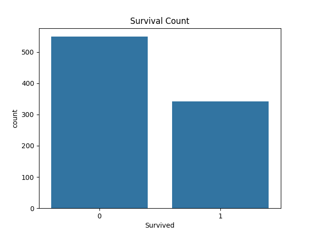
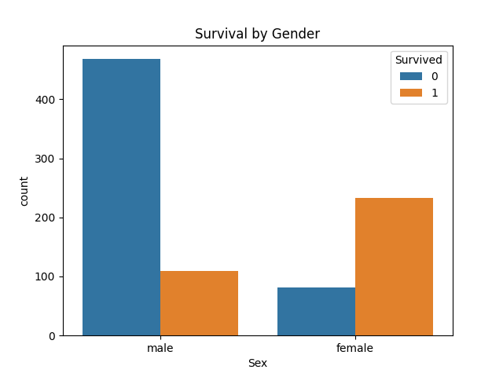
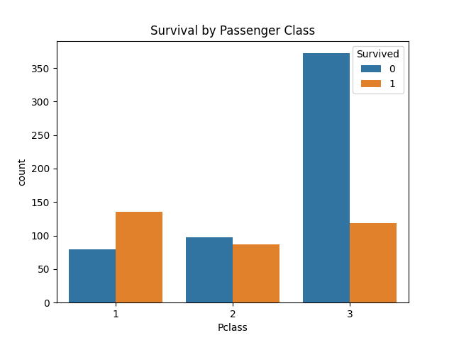

# Task-02 : Titanic Dataset EDA
## Objective
Perform data cleaning and exploratory data analysis on the Titanic dataset.

## Tools Used
- Python
- Pandas
- Matplotlib
- Seaborn

## Tasks Performed
- Data Cleaning
- Handling Missing Values
- Data Visualization
- Exploratory Data Analysis

## Key Insights
- Females survived more than males
- First-class passengers had higher survival rates
- Fare influenced survival probability
## Output Screenshots
### Survival Count

### Survival by Gender

### Survival by Passenger Class

